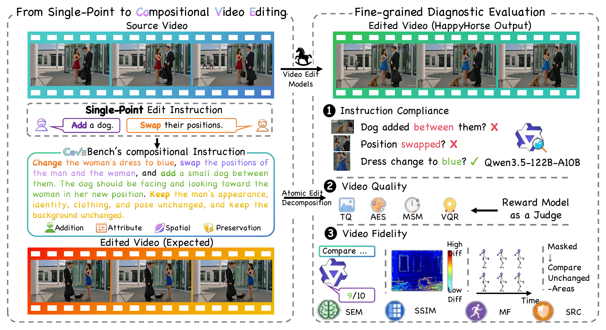
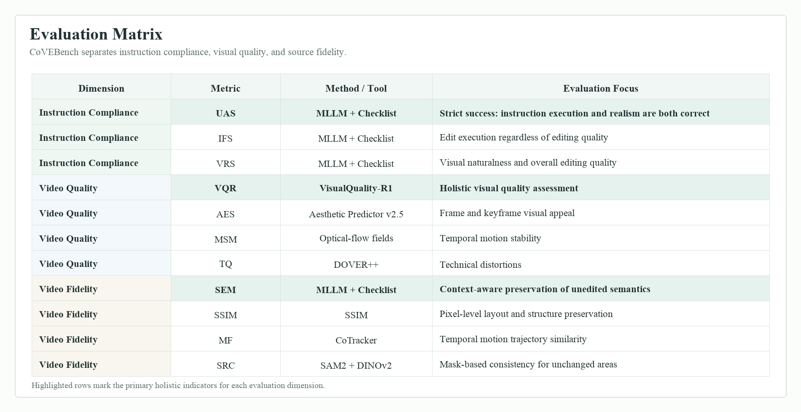

# CoVEBench

**CoVEBench** is a diagnostic benchmark for compositional instruction-guided video editing. Unlike single-operation editing benchmarks, CoVEBench evaluates realistic multi-point instructions that require models to modify requested content while preserving unrelated source-video semantics and temporal coherence.

[Project Page](docs/index.html) | [Paper](docs/assets/paper/CoVEBench.pdf) | [Evaluation Code](metrics)



## What We Evaluate

CoVEBench measures video editing performance across three complementary dimensions: instruction compliance, video quality, and video fidelity. The benchmark combines MLLM-checklist subjective metrics with objective quality and fidelity metrics.



The released metrics are:

| Dimension | Metric | Column | Method |
| --- | --- | --- | --- |
| Instruction Compliance | Union Accuracy | `UAS` | MLLM + checklist |
| Instruction Compliance | Instruction Following Score | `IFS` | MLLM + checklist |
| Instruction Compliance | Video Realism Score | `VRS` | MLLM + checklist |
| Video Quality | Comprehensive Quality | `VQR` | VisualQuality-R1 |
| Video Quality | Aesthetics | `AES` | aesthetic-predictor-v2-5 |
| Video Quality | Motion Smoothness | `MSM` | edited-only optical flow |
| Video Quality | Technical Quality | `TQ` | DOVER++ technical branch |
| Video Fidelity | Semantic Consistency | `SEM` | MLLM + checklist |
| Video Fidelity | Structural Fidelity | `SSIM` | SSIM |
| Video Fidelity | Motion Fidelity | `MF` | CoTracker |
| Video Fidelity | Static Region Consistency | `SRC` | SAM2 + DINOv2 |

## Key Findings

- Current video editing models still struggle with compositional instructions: models often satisfy individual edit points but fail the strict union criterion.
- Editing strength and preservation are not automatically aligned: stronger modifications can unintentionally alter regions that should remain unchanged.
- Fine-grained checklist evaluation exposes failures that are hidden by coarse prompt-level or single-metric scoring.

See the full project page in [`docs/`](docs) for qualitative examples, main results, error analysis, and additional figures.

## Quick Start

Prepare videos with matching numeric task ids:

```text
data/
  checklist.json
  source/
    1.mp4
    2.mp4
  my_model/
    1.mp4
    2.mp4
```

Install the objective evaluation environment and download objective weights:

```bash
bash scripts/setup_env.sh
HF_ENDPOINT=https://hf-mirror.com uv run scripts/download_weights.py
```

Run objective metrics for one model:

```bash
uv run scripts/run_model.py \
  --source-dir data/source \
  --edited-dir data/my_model \
  --checklist data/checklist.json \
  --output-csv outputs/my_model_scores.csv \
  --work-dir outputs/my_model_work \
  --device cuda:0
```

Run subjective MLLM-checklist metrics:

The released subjective judge is `Qwen/Qwen3.5-122B-A10B`. `scripts/run_subjective.py` uses this HF id by default; pass `--model-path` only when using a local checkpoint directory.

```bash
bash scripts/setup_env.sh --subjective
HF_ENDPOINT=https://hf-mirror.com uv run scripts/download_weights.py \
  --include-subjective \
  --subjective-model-repo Qwen/Qwen3.5-122B-A10B
uv run scripts/run_subjective.py \
  --source-dir data/source \
  --edited-dir data/my_model \
  --checklist data/checklist.json \
  --output-csv outputs/my_model_subjective.csv \
  --work-dir outputs/my_model_subjective_work \
  --tensor-parallel-size 2
```

If the judge model is already available locally, skip `--include-subjective` and pass the local checkpoint path, for example `--model-path weights/hf/subjective_judge`.

The released `data/checklist.json` stores source-video paths as relative placeholders. The one-command runners match videos by numeric task id from `--source-dir` and `--edited-dir`, then write a materialized checklist under `--work-dir` with the actual paths used for evaluation.

## Outputs

Objective runner:

```csv
AES,TQ,MSM,SSIM,MF,VQR,SRC
...
```

Subjective runner:

```csv
UAS,IFS,VRS,SEM
...
```

The objective runner also writes a `_with_task_id.csv` file for task-level inspection. The subjective runner writes model-level aggregate scores. Both runners keep intermediate logs/caches under `--work-dir`.

## Repository Layout

```text
docs/                    # project webpage, figures, tables, paper PDF
metrics/vq/              # objective video-quality metrics
metrics/vf/              # objective video-fidelity metrics
metrics/subjective/      # MLLM-checklist subjective metrics
scripts/                 # setup, download, and one-command runners
src/covebench_eval/      # shared runner utilities
configs/                 # example config and metric filter lists
```

Metric-specific details:

- [`metrics/vq/`](metrics/vq): `AES`, `TQ`, `MSM`, `VQR`
- [`metrics/vf/`](metrics/vf): `SSIM`, `MF`, `SRC`
- [`metrics/subjective/`](metrics/subjective): `UAS`, `IFS`, `VRS`, `SEM`

## Reproducibility Notes

- Frame-level metrics use 10 equally spaced frames by default.
- `AES`, `VQR`, and `MSM` are computed on edited videos only.
- `SSIM`, `MF`, and `SRC` compare source and edited videos by matched task id.
- `SRC` can use a provided source-mask cache via `--source-mask-root`; otherwise run the SRC script directly with `--allow-llm` and `LLM_API_KEY`.
- `TQ` uses the DOVER++ technical score, not the overall DOVER++ score.
- Subjective `UAS`, `IFS`, `VRS`, and `SEM` are reported on a 0-100 scale by default, using global question-level aggregation.

## Citation

```bibtex
@misc{covebench2026,
  title        = {CoVEBench: A Diagnostic Benchmark for Compositional Instruction-Guided Video Editing},
  author       = {CoVEBench Team},
  year         = {2026},
  howpublished = {\url{https://github.com/NJU-LINK/CoVEBench}}
}
```
